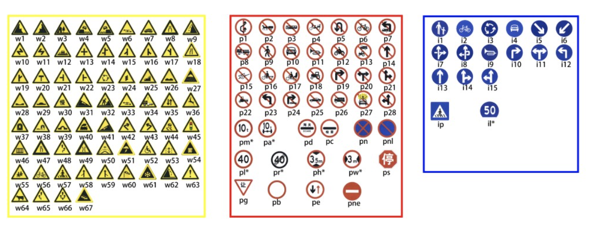

# CS103-Project

paper: https://cg.cs.tsinghua.edu.cn/traffic-sign/0682.pdf

tt100k tutorial: https://cg.cs.tsinghua.edu.cn/traffic-sign/tutorial.html


## Dataset Annonation Transform

### [TT-100k](https://cg.cs.tsinghua.edu.cn/traffic-sign/):

#### The Map between category and traffic sign:



#### The annonation format of JSON:

```json
{
  "imgs": {
    "id": {
      "path": "path/id.jpg",
      "objects": [
        {
          "category": "category_1",
          ...
        },
        ...
        {
          "category": "category_n",
          ...
        }
      ],
      "id": 1
    }
  }
}
```


### [Project Dataset](https://aistudio.baidu.com/aistudio/datasetdetail/107275/0)

#### The Map between category and traffic sign:

category from 0 to 57 ? 

unknow relation

#### The annonation format of CSV:

| file_name | width | height |  x1  |  y1  |  x2  |  y2  | category |
| :-------: | :---: | :----: | :--: | :--: | :--: | :--: | :------: |
|           |       |        |      |      |      |      |          |

